# Proyecto de Microservicios

Proyecto desarrollado utilizando una arquitectura de microservicios para gestionar clientes, productos y compras.

## Tecnologías utilizadas

* Node.js
* Express.js
* MongoDB
* Mongoose
* Docker
* Docker Compose
* Axios
* JWT
* Git
* GitHub

---

# 1. Arquitectura del proyecto

El proyecto está dividido en tres microservicios principales:

* **Customers:** gestión de clientes y autenticación.
* **Products:** gestión de productos.
* **Shopping:** gestión de compras y órdenes.

Cada microservicio funciona de manera independiente y cuenta con su propia base de datos.

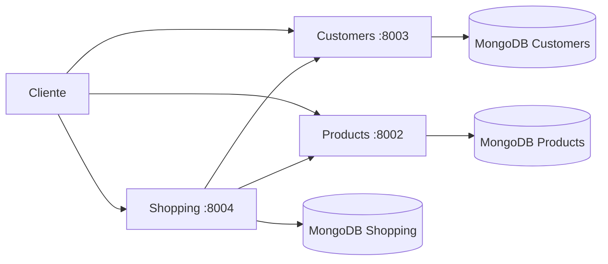

---

# 2. Servicios del proyecto

| Servicio  | Puerto | Base de datos     | Función                  |
| --------- | -----: | ----------------- | ------------------------ |
| Customers | `8003` | MongoDB Customers | Clientes y autenticación |
| Products  | `8002` | MongoDB Products  | Gestión de productos     |
| Shopping  | `8004` | MongoDB Shopping  | Compras y órdenes        |

---

# 3. Estructura del proyecto

```text
microservices-projec-end/
│
├── Customers/
│   ├── src/
│   │   ├── api/
│   │   ├── config/
│   │   ├── database/
│   │   ├── services/
│   │   └── utils/
│   ├── Dockerfile
│   ├── package.json
│   └── package-lock.json
│
├── Products/
│   ├── src/
│   │   ├── api/
│   │   ├── config/
│   │   ├── database/
│   │   ├── services/
│   │   └── utils/
│   ├── Dockerfile
│   ├── package.json
│   └── package-lock.json
│
├── shopping/
│   ├── src/
│   │   ├── api/
│   │   ├── config/
│   │   ├── database/
│   │   ├── services/
│   │   └── utils/
│   ├── Dockerfile
│   ├── package.json
│   └── package-lock.json
│
└── docker-compose.yml
```

Para consultar los archivos de un servicio:

```bash
find src -type f | sort
```

---

# 4. Instalación inicial

## WSL

Desde PowerShell como administrador:

```bash
wsl --install
```

Después de la instalación puede ser necesario reiniciar el computador.

Actualizar WSL:

```bash
wsl --update
```

## Ubuntu

Actualizar los paquetes:

```bash
sudo apt update
sudo apt upgrade
```

Instalar npm:

```bash
sudo apt install npm
```

Instalar jq:

```bash
sudo apt install jq
```

`jq` permite visualizar las respuestas JSON de una forma más organizada.

---

# 5. Crear un proyecto Node.js

Crear una carpeta:

```bash
mkdir microserviciosperez
```

Entrar en la carpeta:

```bash
cd microserviciosperez
```

Inicializar Node.js:

```bash
npm init -y
```

Instalar Express:

```bash
npm install express
```

Instalar Mongoose:

```bash
npm install mongoose
```

Verificar Mongoose:

```bash
npm list mongoose
```

Instalar dotenv:

```bash
npm install dotenv
```

Instalar Axios:

```bash
npm install axios
```

Ejecutar el proyecto:

```bash
npm run dev
```

---

# 6. Git y GitHub

Agregar el repositorio remoto:

```bash
git remote add origin https://github.com/osorio22/backend-mono-api.git
```

Verificar el repositorio:

```bash
git remote -v
```

Agregar los cambios:

```bash
git add .
```

Crear un commit:

```bash
git commit -m "Actualización del proyecto"
```

Subir los cambios:

```bash
git push origin main
```

## Seguridad

Nunca subir información sensible a GitHub.

No subir:

```text
.env
Contraseñas
Tokens
JWT
Claves privadas
Credenciales
```

Agregar `.env` al archivo `.gitignore`:

```gitignore
node_modules/
.env
```

Si un token real fue publicado anteriormente, debe ser revocado y reemplazado.

---

# 7. Docker Compose

Docker Compose permite ejecutar los diferentes servicios del proyecto.

## Ver los contenedores

```bash
docker compose ps
```

También:

```bash
docker ps
```

## Levantar los servicios

```bash
docker compose up
```

## Levantar en segundo plano

```bash
docker compose up -d
```

## Levantar reconstruyendo las imágenes

```bash
docker compose up --build -d
```

## Detener los servicios

```bash
docker compose down
```

## Ver todos los contenedores

```bash
docker ps -a
```

---

# 8. Reconstruir Docker

Si se realizaron cambios importantes en el código o Dockerfile:

```bash
docker compose build --no-cache
```

Después:

```bash
docker compose up -d
```

Para reconstruir únicamente Customers:

```bash
docker compose build --no-cache customer
```

Después:

```bash
docker compose up -d customer
```

También se puede utilizar:

```bash
docker compose up --build -d
```

---

# 9. Eliminar contenedores y volúmenes

Para detener y eliminar los contenedores:

```bash
docker compose down
```

Para eliminar también los volúmenes y contenedores huérfanos:

```bash
docker compose down -v --remove-orphans
```

## Importante

El comando:

```bash
docker compose down -v
```

puede eliminar los volúmenes de MongoDB.

Esto puede provocar pérdida de los datos almacenados.

Utilizarlo solamente cuando sea necesario.

---

# 10. Customers

Customers administra los clientes y el sistema de autenticación.

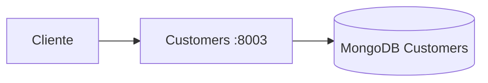

## Ver logs

```bash
docker logs c-customers
```

Últimas 30 líneas:

```bash
docker logs c-customers --tail 30
```

Un resultado correcto debería mostrar:

```text
Database connected
Listening on port 8003
```

---

# 11. MongoDB — Customers

Entrar a MongoDB:

```bash
docker exec -it c-customers-db mongosh
```

Seleccionar la base de datos:

```javascript
use customers
```

Ver las colecciones:

```javascript
show collections
```

Consultar clientes:

```javascript
db.customers.find().pretty()
```

Contar clientes:

```javascript
db.customers.countDocuments()
```

---

# 12. Consultar Customers desde Docker

```bash
docker exec c-customers-db mongosh customers --quiet --eval 'print(EJSON.stringify(db.customers.find().toArray()))' | jq
```

---

# 13. Probar la API de Customers

Consultar clientes:

```bash
curl http://localhost:8003/customer | jq
```

---

# 14. Login de Customers

Ejemplo:

```bash
curl -X POST http://localhost:8003/customer/login \
  -H "Content-Type: application/json" \
  -d '{"email":"juan@example.com","password":"123456"}' | jq
```

Si las credenciales son correctas, el servicio debe devolver un JWT.

Ejemplo:

```json
{
  "token": "TU_TOKEN_AQUI"
}
```

No publicar el JWT real en GitHub.

---

# 15. Autenticación mediante JWT

Guardar temporalmente el token:

```bash
TOKEN='TU_TOKEN_AQUI'
```

Consultar el perfil:

```bash
curl -s http://localhost:8003/customer/profile \
  -H "Authorization: Bearer $TOKEN" | jq
```

Flujo de autenticación:

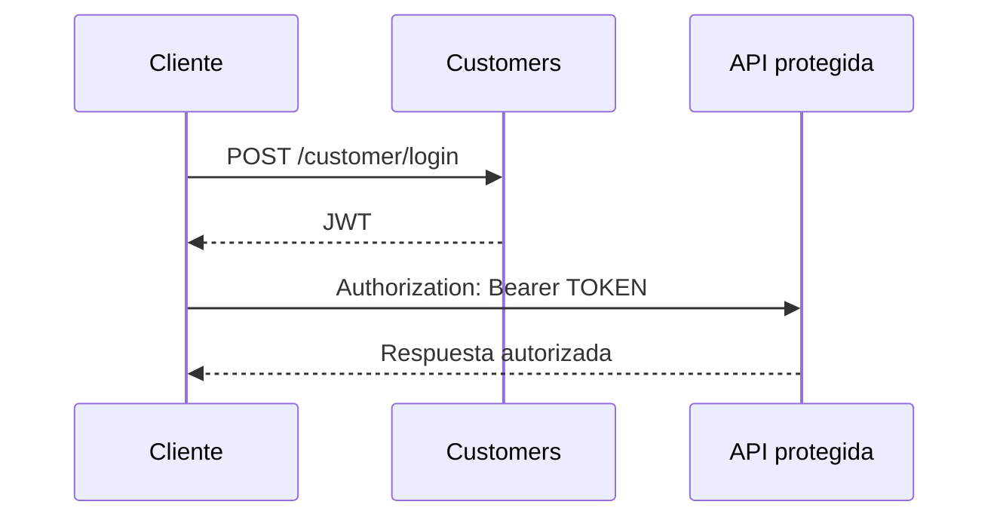

---

# 16. Products

Products administra los productos disponibles.

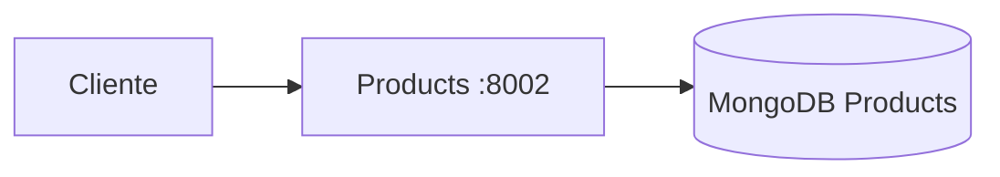

## Ver logs

```bash
docker logs c-products
```

Últimas 30 líneas:

```bash
docker logs c-products --tail 30
```

## Probar Products

```bash
curl http://localhost:8002/products | jq
```

## Ver archivos

```bash
find src -type f | sort
```

---

# 17. Seed de Products

Ejecutar desde el proyecto:

```bash
npm run seed
```

Forzar el seed:

```bash
npm run seed -- --force
```

Desde Docker:

```bash
docker exec c-products npm run seed -- --force
```

---

# 18. Seed de Customers

Ejecutar:

```bash
npm run seed
```

Desde Docker:

```bash
docker exec c-customers npm run seed -- --force
```

---

# 19. Shopping

Shopping administra las compras y órdenes.

Shopping funciona en el puerto:

```text
8004
```

Además, **Shopping tiene su propia base de datos MongoDB**, independiente de Customers y Products.

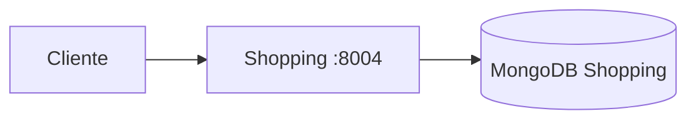

---

# 20. Arquitectura completa de Shopping

Shopping puede comunicarse con Customers y Products mediante peticiones HTTP.

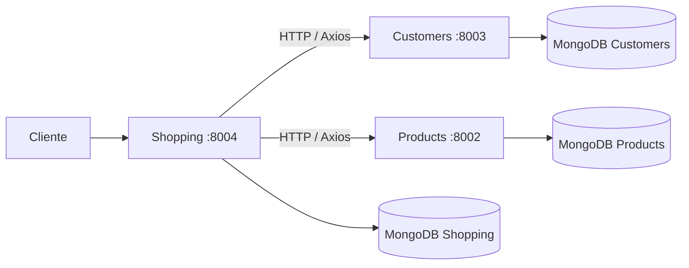

De esta forma:

```text
Customers
    │
    └── MongoDB Customers

Products
    │
    └── MongoDB Products

Shopping
    │
    └── MongoDB Shopping
```

Cada microservicio mantiene su propia información.

---

# 21. Seed de Shopping

Si el servicio tiene configurado el script `seed`:

```bash
docker exec c-shopping npm run seed -- --force
```

---

# 22. Ver logs de Shopping

```bash
docker logs c-shopping
```

Últimas 30 líneas:

```bash
docker logs c-shopping --tail 30
```

---

# 23. Probar Shopping

Shopping funciona mediante el puerto `8004`.

Ejemplo de creación de una orden:

```bash
curl -X POST http://localhost:8004/shopping/order \
  -H "Authorization: Bearer $TOKEN" \
  -H "Content-Type: application/json" \
  -d '{"txnId":"123456"}'
```

La ruta y los datos exactos pueden variar dependiendo de la implementación actual del servicio.

---

# 24. MongoDB — Shopping

El nombre del contenedor de MongoDB para Shopping dependerá del `docker-compose.yml`.

Por ejemplo, si está configurado como:

```text
c-shopping-db
```

se puede entrar con:

```bash
docker exec -it c-shopping-db mongosh
```

Después seleccionar la base de datos:

```javascript
use shopping
```

Ver colecciones:

```javascript
show collections
```

Consultar órdenes:

```javascript
db.orders.find().pretty()
```

> El nombre exacto de la colección dependerá de los modelos utilizados en el microservicio Shopping.

---

# 25. Axios y comunicación entre servicios

Axios permite realizar peticiones HTTP desde Node.js.

Instalar:

```bash
npm install axios
```

La comunicación puede representarse de la siguiente manera:

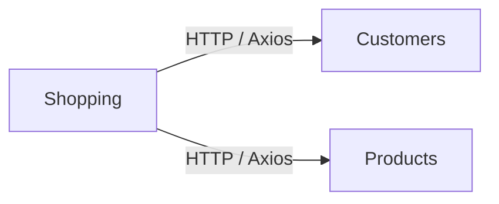

Shopping puede consultar información de clientes y productos mediante sus APIs.

Los microservicios no deberían acceder directamente a las bases de datos de otros servicios.

---

# 26. Puertos del proyecto

| Servicio          |   Puerto |
| ----------------- | -------: |
| Products          |   `8002` |
| Customers         |   `8003` |
| Shopping          |   `8004` |
| Products MongoDB  |  `27017` |
| Customers MongoDB |  `27018` |
| Shopping MongoDB  | `27019`* |

* El puerto externo de MongoDB Shopping debe coincidir con la configuración real de `docker-compose.yml`.

---

# 27. Comprobar todos los contenedores

Ejecutar:

```bash
docker compose ps
```

También:

```bash
docker ps
```

Los contenedores principales deberían ser similares a:

```text
c-customers
c-customers-db
c-products
c-products-db
c-shopping
c-shopping-db
```

---

# 28. Verificar Customers

```bash
docker logs c-customers --tail 30
```

Debe aparecer:

```text
Database connected
Listening on port 8003
```

Probar:

```bash
curl http://localhost:8003/customer | jq
```

---

# 29. Verificar Products

Ver logs:

```bash
docker logs c-products --tail 30
```

Probar:

```bash
curl http://localhost:8002/products | jq
```

---

# 30. Verificar Shopping

Ver logs:

```bash
docker logs c-shopping --tail 30
```

Probar el servicio:

```bash
curl http://localhost:8004
```

Si una ruta requiere autenticación:

```bash
-H "Authorization: Bearer $TOKEN"
```

---

# 31. Secuencia recomendada cuando algo falla

No eliminar los contenedores inmediatamente.

Primero revisar:

```bash
docker compose ps
```

Customers:

```bash
docker logs c-customers --tail 30
```

Products:

```bash
docker logs c-products --tail 30
```

Shopping:

```bash
docker logs c-shopping --tail 30
```

Probar Customers:

```bash
curl http://localhost:8003/customer | jq
```

Probar Products:

```bash
curl http://localhost:8002/products | jq
```

Probar Shopping:

```bash
curl http://localhost:8004
```

Si el problema continúa:

```bash
docker compose down
```

```bash
docker compose build --no-cache
```

```bash
docker compose up -d
```

---

# 32. Comandos principales

## Docker

```bash
docker compose ps
docker compose up -d
docker compose down
docker compose up --build -d
docker compose build --no-cache
docker ps
docker ps -a
```

## Logs

```bash
docker logs c-customers
docker logs c-products
docker logs c-shopping
```

## Customers

```bash
curl http://localhost:8003/customer | jq
```

## Products

```bash
curl http://localhost:8002/products | jq
```

## Shopping

```bash
curl http://localhost:8004
```

## MongoDB Customers

```bash
docker exec -it c-customers-db mongosh
```

## MongoDB Products

```bash
docker exec -it c-products-db mongosh
```

## MongoDB Shopping

```bash
docker exec -it c-shopping-db mongosh
```

## Seeds

```bash
npm run seed
npm run seed -- --force
```

## Estructura

```bash
find src -type f | sort
```

---

# 33. Flujo completo del proyecto

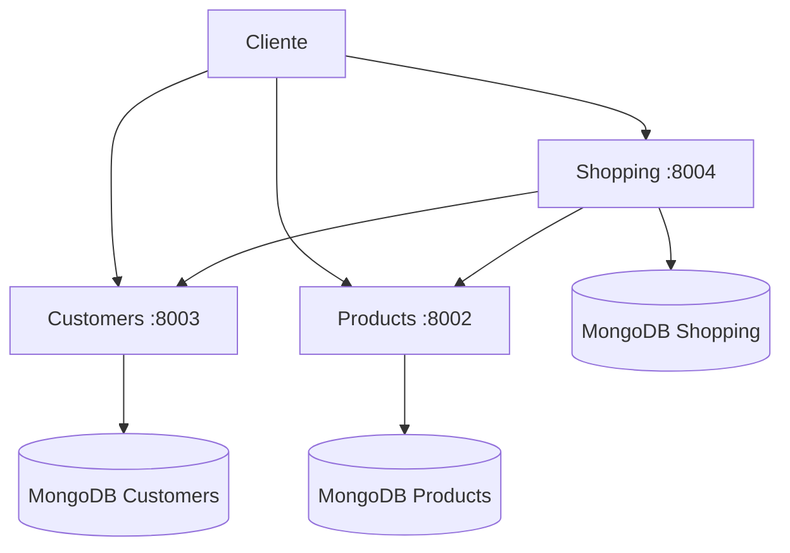

---

# 34. Flujo de una compra

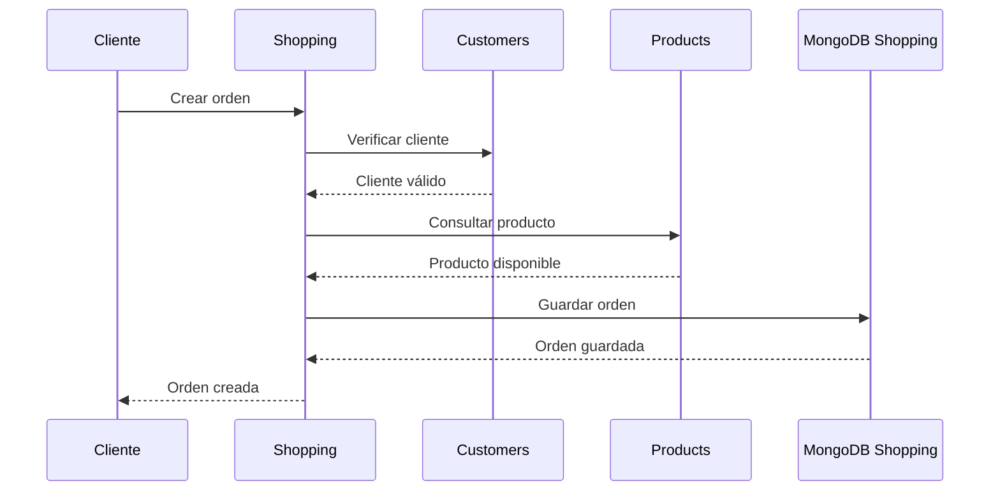

---

# 35. Flujo de autenticación

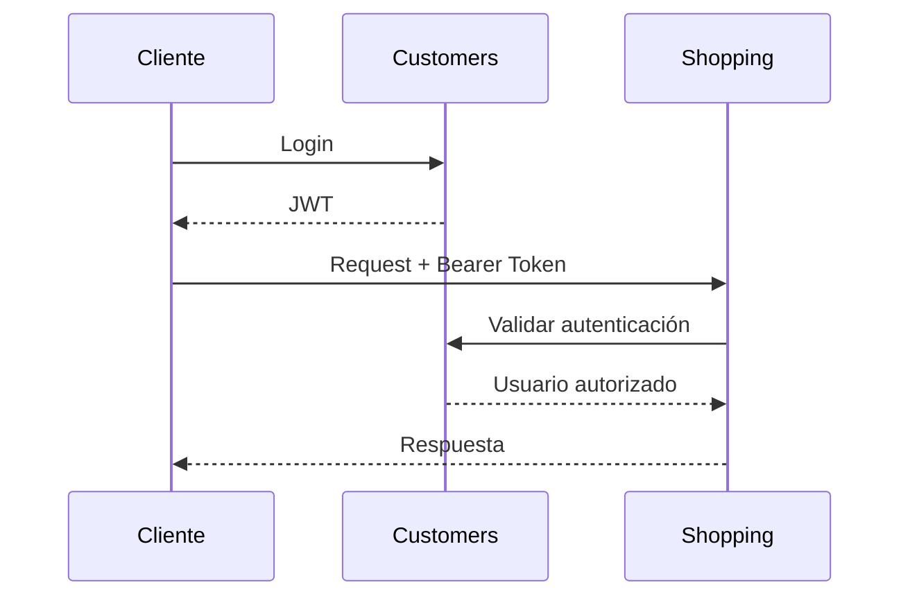

---

# 36. Bases de datos

Cada microservicio utiliza su propia base de datos.

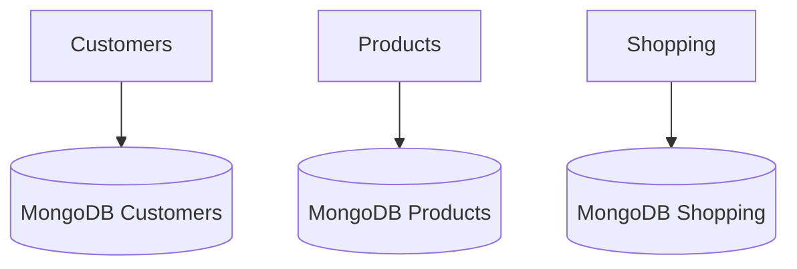

Esta separación permite mantener independientes los datos de cada dominio.

```text
Customers
    ↓
MongoDB Customers

Products
    ↓
MongoDB Products

Shopping
    ↓
MongoDB Shopping
```

---

# 37. Comando de emergencia

Si Docker presenta problemas y es necesario reconstruir todo desde cero:

```bash
docker compose down -v --remove-orphans
```

Después:

```bash
docker compose build --no-cache
```

Finalmente:

```bash
docker compose up -d
```

## Advertencia

El primer comando puede eliminar los volúmenes persistentes de MongoDB.

Antes de ejecutarlo, verificar que no existan datos importantes que deban conservarse.

---

# 38. Checklist del proyecto

Antes de considerar que el proyecto está funcionando correctamente:

* [ ] WSL instalado.
* [ ] Ubuntu funcionando.
* [ ] Node.js instalado.
* [ ] npm funcionando.
* [ ] Docker funcionando.
* [ ] Docker Compose funcionando.
* [ ] MongoDB funcionando.
* [ ] Customers funcionando en `8003`.
* [ ] Products funcionando en `8002`.
* [ ] Shopping funcionando en `8004`.
* [ ] MongoDB Customers funcionando.
* [ ] MongoDB Products funcionando.
* [ ] MongoDB Shopping funcionando.
* [ ] Customers conectado a su base de datos.
* [ ] Products conectado a su base de datos.
* [ ] Shopping conectado a su base de datos.
* [ ] Seed de Customers ejecutado.
* [ ] Seed de Products ejecutado.
* [ ] Seed de Shopping ejecutado.
* [ ] APIs probadas con `curl`.
* [ ] Login funcionando.
* [ ] JWT generado correctamente.
* [ ] Autenticación funcionando.
* [ ] Comunicación entre microservicios funcionando.
* [ ] `.env` protegido.
* [ ] Contraseñas y tokens fuera de GitHub.

---

# 39. Resultado final

La arquitectura final del proyecto es:

```text
                         CLIENTE
                            |
        +-------------------+-------------------+
        |                   |                   |
        v                   v                   v
   CUSTOMERS            PRODUCTS            SHOPPING
     :8003                :8002                :8004
        |                   |                   |
        v                   v                   v
 MongoDB Customers    MongoDB Products    MongoDB Shopping
        |                                       |
        +---------------+-----------------------+
                        |
                 Comunicación HTTP
                    / Axios
```

## Resumen

```text
Customers
- Puerto: 8003
- Clientes
- Login
- JWT
- MongoDB Customers

Products
- Puerto: 8002
- Productos
- MongoDB Products

Shopping
- Puerto: 8004
- Compras
- Órdenes
- MongoDB Shopping
- Comunicación con Customers y Products
```

---

# Conclusión

El proyecto implementa una arquitectura de microservicios utilizando Node.js, Express, MongoDB y Docker.

Cada servicio tiene una responsabilidad independiente y su propia base de datos:

```text
Customers → Clientes y autenticación → MongoDB Customers

Products → Productos → MongoDB Products

Shopping → Compras y órdenes → MongoDB Shopping
```

La comunicación entre los microservicios se realiza mediante APIs HTTP y Axios.

Docker Compose permite ejecutar y administrar todos los servicios y sus bases de datos desde un mismo proyecto.

---

## Información del proyecto

**Proyecto:** Microservicios

**Servicios:** Customers · Products · Shopping

**Puertos:** 8002 · 8003 · 8004

**Tecnologías:** Node.js · Express · MongoDB · Mongoose · Docker · Docker Compose · Axios · JWT · Git · GitHub
