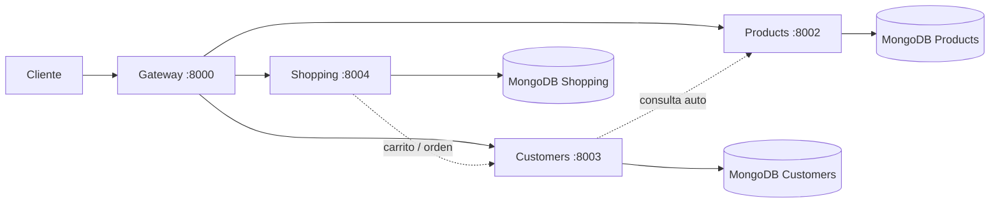
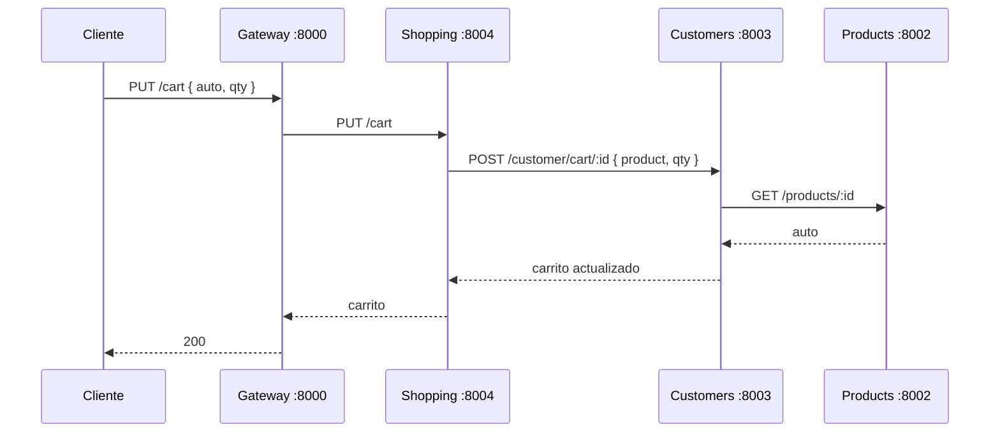

# Proyecto de Microservicios — Car Sales API

[](https://github.com/osorio22/microservices-projec-end/actions/workflows/ci.yml)

API de venta de autos construida con una arquitectura de microservicios.
Cada servicio es independiente, tiene su propia base de datos MongoDB y se
comunica con los demás únicamente mediante peticiones HTTP.

```text
CLIENTE (frontend React / curl)
        │
        ▼
   GATEWAY :8000    ← punto único de entrada
        │
   ┌────┼────┬────┐
   ▼    ▼    ▼    ▼
Customers Products Shopping
   │      │      │
   ▼      ▼      ▼
  DB     DB     DB
```

## Tecnologías

* Node.js (v22+)
* Express.js
* MongoDB 7
* Mongoose
* JWT (`jsonwebtoken`)
* Docker + Docker Compose
* Jest + Supertest + mongodb-memory-server (tests)
* React + Vite + Redux (frontend)

---

## 1. Arquitectura

Cuatro servicios publicados en Docker:

| Servicio  | Puerto | Base de datos         | Función                                    |
| --------- | :----: | --------------------- | ------------------------------------------ |
| Gateway   | 8000   | —                     | Punto de entrada y composición del perfil  |
| Customers | 8003   | MongoDB `customers`   | Clientes y autenticación (JWT)             |
| Products  | 8002   | MongoDB `products`    | Catálogo de autos                          |
| Shopping  | 8004   | MongoDB `shopping`    | Carrito y órdenes de compra                |



Todos los contenedores comparten la red Docker externa `microservices-network`
y se resuelven entre sí por nombre (`c-customers`, `c-products`, `c-shopping`).
Los servicios usan `fetch` nativo de Node.js para comunicarse entre ellos.

> El Gateway es el único servicio que publica puertos hacia el frontend.
> La comunicación entre microservicios **nunca** accede directamente a la
> base de datos de otro servicio.

---

## 2. Estructura del proyecto

```text
microservices-projec-end/
│
├── gateway/
│   ├── src/
│   │   ├── compose-profile.js   ← perfil + carrito
│   │   ├── routes.js            ← rutas y proxy
│   │   └── config/
│   ├── Dockerfile
│   └── docker-compose.yml
│
├── customers/
│   ├── src/
│   │   ├── api/                 ← rutas y middleware de auth
│   │   ├── config/
│   │   ├── database/
│   │   │   ├── models/
│   │   │   ├── repository/
│   │   │   └── seed/
│   │   ├── services/
│   │   └── utils/
│   ├── __tests__/unit/
│   ├── __tests__/integration/
│   ├── Dockerfile
│   └── docker-compose.yml
│
├── Product/
│   ├── src/
│   │   ├── api/
│   │   ├── config/
│   │   ├── database/{models, repository, seed}/
│   │   ├── services/
│   │   └── utils/
│   ├── __tests__/unit/
│   ├── __tests__/integration/
│   ├── Dockerfile
│   └── docker-compose.yml
│
└── shopping/
    ├── src/
    │   ├── api/
    │   ├── config/
    │   ├── database/{models, repository}/
    │   ├── services/
    │   └── utils/
    ├── __tests__/unit/
    ├── __tests__/integration/
    ├── Dockerfile
    └── docker-compose.yml
```

---

## 3. Puesta en marcha

### 3.1 Requisitos

* WSL2 + Ubuntu
* Docker Engine + Docker Compose (`docker compose`)
* Una red Docker compartida (se crea una sola vez):

```bash
docker network create microservices-network
```

### 3.2 Levantar los servicios

Cada servicio tiene su propio `docker-compose.yml` en su carpeta:

```bash
cd microservices-projec-end

cd customers && docker compose up -d --build && cd ..
cd Product   && docker compose up -d --build && cd ..
cd shopping  && docker compose up -d --build && cd ..
cd gateway   && docker compose up -d --build && cd ..
```

> **Importante para el Gateway:** su carpeta **no** está montada como volumen.
> Si modificas su código hay que reconstruirlo:
> `cd gateway && docker compose up -d --build`.

Para levantar todos a la vez (si tienes un compose raíz) o en segundo plano:
`docker compose up -d` desde cada carpeta.

Verificar que los contenedores estén arriba:

```bash
docker ps
```

Deberían aparecer:

```text
c-gateway     (8000)
c-customers   (8003)      c-customers-db   (27018)
c-products    (8002)      c-products-db    (27017)
c-shopping    (8004)      c-shopping-db    (27019)
```

Detener:

```bash
docker compose down        # desde cada carpeta
docker compose down -v --remove-orphans   # ⚠️ borra también los datos de MongoDB
```

---

## 4. Seeds (datos de ejemplo)

### Products — catálogo de autos

El seed carga 10 vehículos de marca (BMW, Mercedes-Benz y Chevrolet:
BMW Serie 5, BMW X5 M, BMW M3 Competition, Mercedes‑Benz Clase C, GLE 350,
AMG A45, Chevrolet Cheyenne 4x4, Colorado Z71, Camaro SS y Corvette Stingray).

```bash
docker exec c-products npm run seed -- --force
```

### Customers — usuarios de prueba

Crea los usuarios `juan@example.com`, `maria@example.com` y `carlos@example.com`
(contraseña: `123456`).

```bash
docker exec c-customers npm run seed -- --force
```

### Shopping

Shopping **no** tiene seed: sus órdenes se generan al hacer compras.

---

## 5. Gateway (puerto 8000)

Es la puerta de entrada para el frontend. Los comandos `curl` de ejemplo usan
el Gateway; los puertos directos de cada servicio aparecen en su sección.

| Método | Ruta del Gateway               | Reenvía a            | Descripción                              |
| ------ | ------------------------------ | -------------------- | ---------------------------------------- |
| GET    | `/`                            | Products             | Lista de autos `{ products, categories }`|
| GET    | `/:id`                         | Products             | Detalle de un auto                       |
| GET    | `/customer/profile`            | Customers + Shopping | Perfil del cliente **combinado** con su carrito |
| GET    | `/customer/shopping-details`   | Shopping             | Carrito de un cliente                    |
| PUT    | `/cart`                        | Shopping             | Agregar un auto al carrito |
| DELETE | `/cart/:productId`             | Shopping             | Quitar un auto del carrito |
| POST   | `/shopping/order`              | Shopping             | Crear la orden de compra |
| POST   | `/customer/login`              | Customers            | Login (devuelve JWT) |
| POST   | `/customer/signup`             | Customers            | Registrar cliente |
| GET    | `/customer/*`, `/wishlist*`    | Customers            | Perfil, wishlist, dirección, etc. |

`GET /customer/profile` combina el perfil del cliente (Customers) con su
carrito (Shopping) en **una sola respuesta** (`compose-profile.js`).

Ejemplo rápido por el Gateway:

```bash
# 1. Login → guarda el token
TOKEN=$(curl -s -X POST http://localhost:8000/customer/login \
  -H "Content-Type: application/json" \
  -d '{"email":"juan@example.com","password":"123456"}' | jq -r .token)

# 2. Perfil compuesto (cliente + carrito)
curl -s http://localhost:8000/customer/profile -H "Authorization: Bearer $TOKEN" | jq

# 3. Agregar un auto al carrito
curl -s -X PUT http://localhost:8000/cart \
  -H "Authorization: Bearer $TOKEN" -H "Content-Type: application/json" \
  -d '{"_id":"ID_DEL_AUTO","qty":1}' | jq

# 4. Realizar el pedido (registra la orden y vacía el carrito)
curl -s -X POST http://localhost:8000/shopping/order \
  -H "Authorization: Bearer $TOKEN" -H "Content-Type: application/json" \
  -d '{"txnId":"TX-001"}' | jq
```

---

## 6. API por servicio

### 6.1 Customers (8003)

| Método | Ruta                                      | Auth | Descripción |
| ------ | ----------------------------------------- | :--: | ----------- |
| GET    | `/customer` / `/customer/all`             |  ✗   | Lista de clientes |
| POST   | `/customer/signup`                        |  ✗   | Registro → `{ id, token }` |
| POST   | `/customer/login`                         |  ✗   | Login → `{ id, token }` |
| GET    | `/customer/profile`                       |  ✓   | Perfil del cliente |
| GET    | `/customer/shopping-details`              |  ✓   | `{ cart, wishlist, orders }` |
| GET    | `/customer/wishlist`                      |  ✓   | Wishlist |
| PUT    | `/customer/wishlist`  `{ product }`       |  ✓   | Agregar a wishlist |
| DELETE | `/customer/wishlist/:productId`           |  ✓   | Quitar de wishlist |
| GET    | `/customer/cart/:customerId`              |  ✓   | Carrito |
| POST   | `/customer/cart/:customerId` `{ product, qty }` | ✓ | Agregar al carrito (consulta el auto en Products) |
| DELETE | `/customer/cart/:customerId/:productId`   |  ✓   | Quitar del carrito |
| POST   | `/customer/order/:customerId` `{ order }` |  ✓   | Registra la orden y **vacía el carrito** |
| POST   | `/customer/address`                       |  ✓   | Agregar dirección |

Autenticación: middleware que valida el JWT (`Authorization: Bearer <token>`)
y lo interpreta con `APP_SECRET`.

### 6.2 Products (8002)

| Método | Ruta             | Descripción |
| ------ | ---------------- | ----------- |
| POST   | `/products`      | Crear un auto |
| GET    | `/products`      | Lista `{ products, categories }` |
| GET    | `/products/:id`  | Detalle (404 si no existe) |

### 6.3 Shopping (8004)

| Método | Ruta                          | Auth | Descripción |
| ------ | ----------------------------- | :--: | ----------- |
| PUT    | `/cart` `{ _id, qty }`        |  ✓   | Agrega al carrito (lo envía a Customers) |
| DELETE | `/cart/:productId`            |  ✓   | Quita del carrito (lo envía a Customers) |
| GET    | `/customer/shopping-details`  |  ✓   | Carrito del cliente |
| POST   | `/shopping/order` `{ txnId }` |  ✓   | Crea la orden en su BD, la registra en Customers (clears cart) |

---

## 7. Comunicación entre microservicios

Los microservicios se llaman entre sí con `fetch` (Node.js nativo), usando el
nombre del contenedor en la red `microservices-network`:

```text
customers  →  http://c-products:8002/products/:id   (al agregar al carrito)
shopping   →  http://c-customers:8003/customer/*     (carrito y órdenes)
gateway    →  http://host.docker.internal:8002/8003/8004  (proxy HTTP)
```



---

## 8. Autenticación (JWT)

1. `POST /customer/login` con `email` y `password` → devuelve `{ id, token }`.
2. El token se envía en cada petición protegida:

```bash
curl -s http://localhost:8000/customer/profile \
  -H "Authorization: Bearer $TOKEN" | jq
```


> Nunca subas a GitHub el archivo `.env`, tokens ni contraseñas reales.

---

## 9. Base de datos

Cada servicio usa su propia instancia MongoDB y colecciones:

```text
customers  →  db.customers         (cuenta con cart, wishlist, orders, address)
products   →  db.products
shopping   →  db.orders
```

Consultar desde Docker:

```bash
# Customers (host 27018)
docker exec -it c-customers-db mongosh
# Products (host 27017)
docker exec -it c-products-db mongosh
# Shopping (host 27019)
docker exec -it c-shopping-db mongosh
```

Dentro de mongosh:

```javascript
show databases
use customers            // o products / shopping
show collections
db.customers.find().pretty()   // o db.products / db.orders
```

---

## 10. Tests

Cada servicio tiene tests **unit** y **integration** (Jest + Supertest).
Los tests de integración usan **mongodb-memory-server** (la primera ejecución
descarga el binario automáticamente) y tokens JWT reales.

```bash
# desde cada carpeta: customers / Product / shopping
npm install              # una sola vez

npm run test:unit        # API, servicios, repositorios, auth y utilidades
npm run test:integration # API real + MongoDB real (registro, login, carrito, órdenes, catálogo)
npm test                 # ambos
```

Cobertura actual:

* Customers: 10 tests de integración (signup, login, perfil, wishlist, carrito, orden, dirección).
* Shopping:  8 tests de integración (auth, `PUT/DELETE /cart`, `shopping-details`, `POST /shopping/order` con persistencia real y carrito vacío).
* Products:  5 tests de integración (listar, crear, detalle y 404).

---

## 11. Frontend

El frontend es una app **React + Vite + Redux** ubicada fuera de este repo:
`home/juanito1/proyectos/frontend-enfasis-i`.

* Su `baseURL` apunta al Gateway: `http://localhost:8000`
  (variable `VITE_API_URL`, si no está definida usa `http://localhost:8000`).
* `src/utils/productImage.js` mapea la marca del auto (BMW, Mercedes, Camaro,
  Chevrolet, …) a fotos de Unsplash; si no reconoce la marca asigna una foto
  aleatoria de un carro de marca.

Levantarlo:

```bash
cd ../frontend-enfasis-i
npm install
npm run dev      # http://localhost:5173
```

---

## 12. Verificación y solución de problemas

Ver logs:

```bash
docker logs c-customers --tail 30
docker logs c-products  --tail 30
docker logs c-shopping  --tail 30
docker logs c-gateway   --tail 30
```

Un arranque correcto de Customers/Shopping muestra:

```text
Database connected
Listening on port 8003   # (8002 / 8004 según el servicio)
```

Cambios en el código de `customers`, `Product` o `shopping` se aplican al
reiniciar el contenedor (código montado como volumen):

```bash
docker restart c-customers
docker restart c-products
docker restart c-shopping
```

El Gateway requiere reconstrucción:

```bash
cd gateway && docker compose up -d --build
```

Si algo no responde:

1. `docker ps` — ¿están los 4 servicios y los 3 mongo arriba?
2. `docker network ls` — ¿existe `microservices-network`?
3. Revisa los logs de cada servicio (sección anterior).
4. Prueba cada API directa: `curl http://localhost:8002/products | jq`,
   `curl http://localhost:8003/customer | jq`,
   `curl -X POST http://localhost:8000/customer/login -H "Content-Type: application/json" -d '{"email":"juan@example.com","password":"123456"}'`.
5. Como último recurso (⚠️ borra los volúmenes de MongoDB):

```bash
cd customers && docker compose down -v --remove-orphans && docker compose up -d --build
cd Product   && docker compose down -v --remove-orphans && docker compose up -d --build
cd shopping  && docker compose down -v --remove-orphans && docker compose up -d --build
cd gateway   && docker compose down -v --remove-orphans && docker compose up -d --build
```

---

## 13. Puertos

| Servicio             | Puerto de la API | MongoDB (host) |
| -------------------- | :--------------: | :------------: |
| Gateway              | `8000`           | —              |
| Products             | `8002`           | `27017`        |
| Customers            | `8003`           | `27018`        |
| Shopping             | `8004`           | `27019`        |

---

## 14. Comandos útiles

```bash
# Docker
docker ps
docker compose logs -f
docker restart c-customers c-products c-shopping

# Seeds
docker exec c-products  npm run seed -- --force
docker exec c-customers npm run seed -- --force

# Tests (desde la carpeta de cada servicio)
npm run test:unit
npm run test:integration

# APIs
curl http://localhost:8002/products | jq
curl http://localhost:8000/customer/login -X POST -H "Content-Type: application/json" -d '{"email":"juan@example.com","password":"123456"}'
```

---

## Conclusión

El proyecto implementa una arquitectura de microservicios (Gateway, Customers,
Products y Shopping) con Node.js, Express, MongoDB y Docker Compose. Cada
servicio es independiente y posee su propia base de datos; la comunicación se
realiza exclusivamente por HTTP a través de una red Docker compartida, con
autenticación JWT y una suite de tests unitarios e de integración.

**Proyecto:** Microservicios Car Sales API

**Servicios:** Gateway · Customers · Products · Shopping

**Puertos:** 8000 · 8002 · 8003 · 8004 · (Mongo 27017/27018/27019)

**Tecnologías:** Node.js · Express · MongoDB · Mongoose · Docker · Docker Compose · JWT · Jest